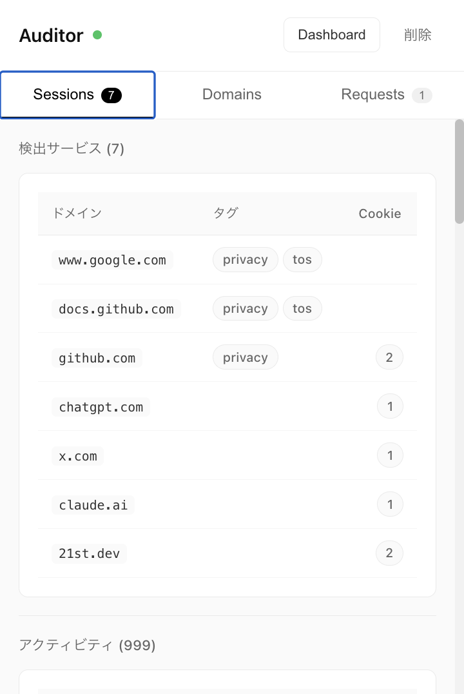

# Pleno Audit

`#Browser Detection and Response (BDR)` `#CASB` `#Browser Security`

## Features

- Local First: すべてのデータ処理はブラウザ内で完結します。外部DBも用いません
- Shadow IT
    - Service Detection: ドメイン・Cookie・ネットワークリクエストからサービスを特定
    - Service Policy Detection: 独自アルゴリズムでプライバシーポリシー／利用規約を特定
    - AIプロンプト検出
- Phishing
    - NRD(Newly Registered Domain)検出
    - Typosquatting検出
- Malware
    - CSP Audit: Content Security Policy違反の検出・レポート・ポリシー生成

## Screenshots

### Dashboard

### Popup

| Sessions | Domains | Requests |
|----------|---------|----------|
|  |  |  |

## インストール

1. [Releases](https://github.com/HikaruEgashira/pleno-audit/releases)から最新版をダウンロード
   - **pleno-audit.zip**: メイン拡張機能（CASB/Browser Security）
   - **pleno-battacker.zip**: 防御耐性テストツール
2. ダウンロードしたzipファイルを展開
3. Chrome で `chrome://extensions` を開く
4. 右上の「デベロッパーモード」を有効にする
5. 「パッケージ化されていない拡張機能を読み込む」をクリック
6. 展開したフォルダを選択

[Canary Releases](https://github.com/HikaruEgashira/pleno-audit/releases?q=canary&expanded=true)

## Documentation

詳細な設計判断については [ADR (Architecture Decision Records)](./docs/adr/README.md) を参照してください。

## License

AGPL 3.0
